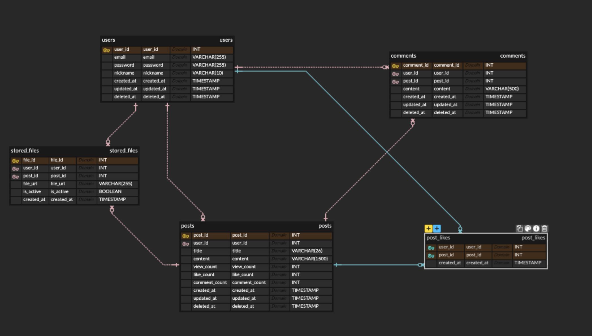
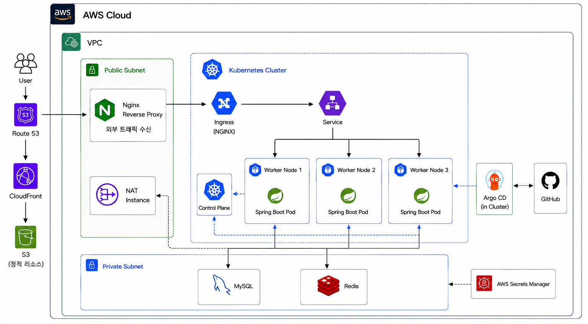

# 🐶 Lovey Doggy

반려견 보호자들이 자유롭게 이야기를 나누고 소통할 수 있는 커뮤니티 서비스입니다.

## Back-end 소개

- Spring Boot 기반 REST API 서버를 구현했습니다.
- 회원, 게시글, 댓글, 좋아요 기능을 구현했습니다.
- 제목, 제목 + 내용, 작성자 기준의 게시글 검색 기능을 구현했습니다.
- 최신순, 조회수순, 좋아요순 정렬과 커서 기반 페이지네이션을 적용했습니다.
- QueryDSL을 활용하여 검색 및 정렬 조건에 따라 게시글을 동적으로 조회하도록 구성했습니다.
- Redis 캐시를 활용하여 반복적인 게시글 조회와 조회수 처리 과정의 DB 접근을 줄였습니다.
- 게시글 조회 패턴에 맞춰 데이터베이스 인덱스를 설계하고, `EXPLAIN`과 `EXPLAIN ANALYZE`를 통해 실행 계획을 검증했습니다.
- AWS 환경에 서비스를 배포하고 Docker 및 Kubernetes 기반으로 운영했습니다.
- Helm과 Argo CD를 활용한 GitOps 배포 환경을 구성했습니다.
- Prometheus, Grafana, Loki를 활용하여 애플리케이션과 Kubernetes 환경을 모니터링했습니다.

## 개발 인원 및 기간

- 개발 인원 : 1명 (개인 프로젝트)
- 개발 기간 : 2026.05.18 - 2026.08.09

## 사용 기술 및 Tools

### Back-end

- Java
- Spring Boot
- Spring Data JPA
- QueryDSL

### Database / Cache

- MySQL
- Redis

### Infrastructure

- AWS
- Docker
- Kubernetes
- Helm
- Argo CD
- GitHub Actions
- Nginx

### Storage

- AWS S3
- CloudFront

### Monitoring

- Prometheus
- Grafana
- Loki
- Node Exporter
- kube-state-metrics

## Front-end

- [Front-end GitHub](https://github.com/100-hours-a-week/4-ayel-community-FE)

---

## 주요 기능

### 회원 / 인증

- 회원가입
- 로그인 / 로그아웃
- 이메일 중복 확인
- 닉네임 중복 확인
- 로그인 상태 확인
- 회원 정보 조회 및 수정
- 비밀번호 변경
- 회원 탈퇴
- 프로필 이미지 관리
- HttpSession 기반 인증
- Redis 기반 세션 저장

회원가입과 로그인 성공 시 세션에 회원 ID를 저장하고,
인증이 필요한 요청에서는 세션에 저장된 회원 ID를 기준으로 사용자를 식별하도록 구성했습니다.

회원가입 직후에도 세션을 생성하여 별도의 로그인 과정 없이 서비스를 이용할 수 있도록 처리했습니다.

### 게시글

- 게시글 작성 / 조회 / 수정 / 삭제
- 게시글 검색
    - 제목
    - 제목 + 내용
    - 작성자
- 게시글 정렬
    - 최신순
    - 조회수순
    - 좋아요순
- 커서 기반 페이지네이션
- 최근 7일 기준 주간 인기글 조회
- 게시글 조회수 관리
- 게시글 좋아요 / 좋아요 취소
- 게시글 이미지 관리

게시글 목록 조회는 정렬 기준값과 게시글 ID를 Cursor로 전달하여 다음 데이터를 조회하도록 구성했습니다.

게시글 상세 조회는 로그인 사용자뿐 아니라 비회원도 접근할 수 있도록 구성했습니다.
비회원 요청에도 세션을 생성하고 Session ID를 Service 계층에 전달하여 반복 조회를 구분할 수 있도록 처리했습니다.

### 댓글

- 댓글 작성 / 조회 / 수정 / 삭제
- 게시글별 댓글 조회
- 커서 기반 댓글 페이지네이션

댓글 목록 역시 전체 데이터를 한 번에 조회하지 않고,
마지막 댓글 ID를 Cursor로 사용하여 다음 댓글을 조회하도록 구성했습니다.

### 좋아요

- 게시글 좋아요
- 게시글 좋아요 취소
- 로그인 사용자 기준 좋아요 처리
- 동일 게시글 중복 좋아요 방지

### 이미지

- 프로필 이미지 업로드 / 삭제
- 게시글 이미지 업로드 / 삭제
- AWS S3 Presigned URL 발급
- 파일 정보 관리

이미지 파일을 애플리케이션 서버가 직접 전달받아 S3로 업로드하지 않고,
백엔드에서 Presigned URL을 발급한 뒤 클라이언트가 S3에 직접 업로드하도록 구성했습니다.

이를 통해 이미지 파일 전송 트래픽과 애플리케이션 API 처리를 분리했습니다.

---

## API

### 인증

| 기능 | Method | Endpoint |
| --- | --- | --- |
| 로그인 | POST | `/auth` |
| 로그아웃 | DELETE | `/auth` |
| 로그인 상태 확인 | GET | `/auth/check` |

### 회원

| 기능 | Method | Endpoint |
| --- | --- | --- |
| 이메일 중복 확인 | GET | `/users/check-email` |
| 닉네임 중복 확인 | GET | `/users/check-nickname` |
| 회원가입 | POST | `/users` |
| 회원 조회 | GET | `/users/{userId}` |
| 회원 정보 수정 | PATCH | `/users/{userId}` |
| 비밀번호 변경 | PUT | `/users/{userId}/password` |
| 회원 탈퇴 | DELETE | `/users/{userId}` |

### 게시글

| 기능 | Method | Endpoint |
| --- | --- | --- |
| 게시글 작성 | POST | `/posts` |
| 게시글 목록 조회 | GET | `/posts` |
| 주간 인기글 조회 | GET | `/posts/popular/weekly` |
| 게시글 검색 | GET | `/posts/search` |
| 게시글 상세 조회 | GET | `/posts/{postId}` |
| 게시글 수정 | PATCH | `/posts/{postId}` |
| 게시글 삭제 | DELETE | `/posts/{postId}` |

#### 게시글 목록 Query Parameter

| Parameter | 설명 |
| --- | --- |
| `sort` | 최신순 / 조회수순 / 좋아요순 |
| `cursorSortValue` | 이전 페이지 마지막 게시글의 정렬 기준값 |
| `cursorPostId` | 동일 정렬값 처리를 위한 게시글 ID |
| `limit` | 한 번에 조회할 게시글 수 |

#### 게시글 검색 Query Parameter

| Parameter | 설명 |
| --- | --- |
| `keyword` | 검색어 |
| `searchType` | 제목 / 제목 + 내용 / 작성자 |
| `sort` | 최신순 / 조회수순 / 좋아요순 |
| `cursorSortValue` | 다음 조회를 위한 정렬 Cursor |
| `cursorPostId` | 동일 정렬값 처리를 위한 보조 Cursor |
| `limit` | 조회 개수 |

### 댓글

| 기능 | Method | Endpoint |
| --- | --- | --- |
| 댓글 작성 | POST | `/posts/{postId}/comments` |
| 댓글 목록 조회 | GET | `/posts/{postId}/comments` |
| 댓글 수정 | PATCH | `/posts/{postId}/comments/{commentId}` |
| 댓글 삭제 | DELETE | `/posts/{postId}/comments/{commentId}` |

댓글 목록 조회는 `cursor`, `limit`을 이용한 Cursor 기반 페이지네이션을 지원합니다.

### 좋아요

| 기능 | Method | Endpoint |
| --- | --- | --- |
| 좋아요 추가 | POST | `/posts/{postId}/likes` |
| 좋아요 취소 | DELETE | `/posts/{postId}/likes` |

### 이미지

| 기능 | Method | Endpoint |
| --- | --- | --- |
| 프로필 이미지 Presigned URL 발급 | POST | `/users/profile-file/presigned-url` |
| 게시글 이미지 Presigned URL 발급 | POST | `/posts/files/presigned-url` |
| 프로필 이미지 삭제 | DELETE | `/users/{userId}/files` |
| 게시글 이미지 삭제 | DELETE | `/posts/{postId}/files/{fileId}` |

---

## 데이터베이스

### ERD Diagram



---

## 성능 개선

### 1. 무한 스크롤을 위한 커서 기반 페이지네이션 설계

#### 설계 배경

게시글 목록은 무한 스크롤 방식으로 제공하기 때문에
사용자가 목록을 탐색하면서 다음 데이터를 연속적으로 조회하는 구조가 필요했습니다.

페이지 번호와 Offset을 기준으로 데이터를 조회하는 방식보다,
마지막으로 조회한 데이터를 기준으로 다음 목록을 이어서 조회하는 Cursor 방식을 선택했습니다.

#### 구현

게시글 정렬은 최신순, 조회수순, 좋아요순을 지원하기 때문에
정렬 방식에 따라 마지막 게시글의 정렬 기준값을 `cursorSortValue`로 사용했습니다.

다만 조회수나 좋아요 수는 여러 게시글에서 동일할 수 있기 때문에
정렬 기준값만으로는 마지막으로 조회한 게시글의 위치를 정확하게 표현할 수 없습니다.

이를 해결하기 위해 게시글 ID인 `cursorPostId`를 보조 Cursor로 함께 사용했습니다.

예를 들어 조회수순에서는 다음과 같이 두 값을 기준으로 정렬합니다.

`view_count DESC, post_id DESC`

따라서 다음 페이지 조회 시에도
마지막 게시글의 조회수와 게시글 ID를 함께 기준으로 사용하여
동일한 조회수를 가진 게시글까지 순서대로 이어서 조회할 수 있도록 구성했습니다.

#### 결과

페이지 번호가 아닌 마지막으로 조회한 게시글을 기준으로
다음 데이터를 이어서 조회할 수 있도록 구성하여 무한 스크롤과 연동했습니다.

또한 조회수나 좋아요 수처럼 동일한 정렬값을 가진 게시글이 존재하더라도
`postId`를 보조 정렬 기준으로 사용하여 안정적인 조회 순서를 유지하도록 설계했습니다.

---

### 2. 게시글 목록 조회 쿼리 최적화

#### 문제

게시글 목록에서는 게시글의 전체 데이터가 필요하지 않습니다.

목록 화면에서 필요한 정보는 제목, 본문 일부, 작성자, 조회수, 좋아요 수, 댓글 수 등이지만
Entity 전체를 조회하면 화면에서 사용하지 않는 데이터까지 함께 읽게 됩니다.

특히 게시글 본문은 최대 1,500자까지 저장할 수 있지만
목록에서는 전체 본문이 필요하지 않았습니다.

#### 개선

QueryDSL Projection을 사용하여 게시글 목록 화면에서 필요한 컬럼만 DTO로 직접 조회하도록 구성했습니다.

본문 역시 전체 본문을 애플리케이션으로 가져온 뒤 잘라내지 않고,
DB 조회 단계에서 목록 미리보기에 필요한 100자만 조회하도록 처리했습니다.

목록과 상세 조회의 목적도 분리했습니다.

- 목록 조회 : 필요한 컬럼만 Projection
- 상세 조회 : 게시글 전체 정보 조회

또한 제목, 제목 + 내용, 작성자 검색 조건을 QueryDSL 동적 조건으로 구성하여
하나의 목록 조회 구조에서 검색 조건을 유연하게 적용할 수 있도록 했습니다.

#### 결과

게시글 목록 조회 시 불필요한 Entity 전체 로딩을 줄이고
화면에 필요한 데이터만 조회하도록 구조를 개선했습니다.

또한 목록 조회와 상세 조회의 책임을 분리하여
각 조회 패턴에 맞춰 인덱스와 캐시 전략을 독립적으로 개선할 수 있도록 구성했습니다.

---

### 3. 데이터베이스 인덱스 최적화

#### 문제

게시글 목록에서 최신순, 조회수순, 좋아요순 정렬을 지원하면서
데이터가 증가할수록 정렬 비용과 조회 성능을 고려할 필요가 있었습니다.

또한 일반 게시글 목록에서는 삭제된 게시글을 제외하기 위해
`deleted_at IS NULL` 조건이 반복적으로 사용됩니다.

#### 개선

실제 게시글 목록의 조회 조건과 정렬 패턴을 기준으로 복합 인덱스를 설계했습니다.

주요 조회 패턴은 다음과 같습니다.

- 삭제되지 않은 게시글
- 조회수 또는 좋아요 수 기준 내림차순
- 동일한 정렬값에서는 게시글 ID 기준 내림차순

이를 기준으로 다음과 같은 복합 인덱스를 적용했습니다.

```
(deleted_at, view_count DESC, post_id DESC)
(deleted_at, like_count DESC, post_id DESC)
```

---

### 4. Redis 캐시를 활용한 게시글 상세 조회 성능 개선

#### 문제

게시글 상세 조회는 동일한 게시글에 반복적으로 요청이 발생할 수 있는 읽기 중심 API입니다.

기존에는 게시글을 조회할 때마다 MySQL에 접근하여 게시글 정보를 조회했기 때문에,
동일한 게시글에 요청이 반복될 경우 불필요한 DB 조회가 계속 발생하는 구조였습니다.

#### 개선

게시글 상세 조회 결과를 Redis에 캐싱하여 동일한 게시글에 대한 반복 조회 시
MySQL에 매번 접근하지 않고 Redis의 캐시 데이터를 반환하도록 개선했습니다.

캐시가 존재하지 않는 경우에는 MySQL에서 게시글을 조회한 뒤 Redis에 저장하고,
이후 동일한 게시글 요청에서는 저장된 캐시를 사용하도록 구성했습니다.

게시글이 수정되거나 삭제되는 경우에는 기존 캐시를 제거하여
변경 이전의 데이터가 반환되지 않도록 처리했습니다.

#### 성능 검증

JMeter를 이용하여 동일한 조건에서 게시글 상세 조회 API에 1,000건의 요청을 수행하고
Redis 캐시 적용 전후의 성능을 비교했습니다.

| 항목 | Redis 적용 전 | Redis 적용 후 |
| --- | ---: | ---: |
| 요청 수 | 1,000 | 1,000 |
| 평균 응답 시간 | 159 ms | 10 ms |
| 최소 응답 시간 | 27 ms | 1 ms |
| 최대 응답 시간 | 656 ms | 89 ms |
| 처리량 | 80.9 req/sec | 973.7 req/sec |
| 오류율 | 0.00% | 0.00% |

#### 결과

Redis 캐시 적용 후 평균 응답 시간이 **159ms에서 10ms로 약 93.7% 감소**했습니다.

동일한 1,000건의 요청에서 처리량 역시
**80.9 req/sec에서 973.7 req/sec로 약 12배 증가**했습니다.

반복적으로 조회되는 게시글 데이터를 Redis에서 반환하도록 변경하여
DB 접근 횟수를 줄이고 게시글 상세 조회 API의 응답 성능을 개선했습니다.

---

### 5. Redis를 활용한 조회수 쓰기 최적화 및 중복 조회 방지

#### 문제

게시글 상세 조회가 발생할 때마다 조회수를 즉시 증가시키는 방식에서는
하나의 조회 요청마다 DB의 `view_count`를 변경하는 UPDATE 쿼리가 발생합니다.

따라서 조회 요청이 많아질수록 읽기 요청이 DB 쓰기 작업으로 이어지고,
동일한 사용자가 새로고침을 반복하는 경우에도 조회수가 계속 증가하는 문제가 있었습니다.

특히 단순 새로고침이나 반복 요청만으로 조회수를 증가시킬 수 있어
실제 게시글 조회 수보다 과도하게 집계될 수 있었습니다.

#### 개선

Redis를 이용하여 일정 시간 동안 동일한 사용자의 동일 게시글 조회 여부를 저장하도록 구성했습니다.

게시글 상세 조회는 로그인 사용자뿐 아니라 비회원도 가능하기 때문에
회원 ID만을 기준으로 중복 조회를 판단할 수 없었습니다.

따라서 요청 시 생성되는 Session ID를 이용하여 사용자를 구분하고,
게시글 ID와 조합하여 Redis에 조회 여부를 기록하도록 구성했습니다.

**조회수 처리 흐름**

1. 게시글 상세 조회 요청
2. Session ID와 Post ID를 기준으로 Redis에서 조회 기록 확인
3. 조회 기록이 없으면 조회수 증가 후 Redis에 조회 기록 저장
4. 조회 기록이 존재하면 조회수를 증가시키지 않음

조회 기록에는 TTL을 적용하여 일정 시간이 지나면 자동으로 만료되도록 구성했습니다.

TTL이 유지되는 동안 동일한 세션에서 같은 게시글을 반복 조회하더라도
조회수는 한 번만 증가하도록 처리했습니다.

TTL이 만료된 이후 다시 조회하면 새로운 조회로 판단하여
다시 조회수 증가 대상이 되도록 구성했습니다.

Redis의 TTL을 활용했기 때문에
중복 조회 기록을 별도의 DB 테이블이나 스케줄러로 정리하지 않아도 되도록 했습니다.

#### 결과

동일 사용자가 새로고침을 반복하거나 같은 게시글에 연속으로 접근하더라도
일정 시간 동안 조회수가 중복 증가하지 않도록 하여 조회수 어뷰징을 방지했습니다.

또한 모든 상세 조회 요청이 DB의 `view_count` UPDATE로 이어지지 않고,
Redis에서 중복 여부를 먼저 확인한 뒤 필요한 경우에만 조회수를 증가시키도록 변경하여
불필요한 DB 쓰기 작업을 줄였습니다.

결과적으로 Redis를 게시글 상세 조회 캐시뿐 아니라
조회수 중복 제어에도 활용하여 읽기와 쓰기 측면을 각각 개선했습니다.

---

### 6. S3 Presigned URL을 활용한 이미지 업로드

#### 문제

이미지를 애플리케이션 서버가 직접 전달받은 뒤 S3에 업로드하는 방식에서는
이미지 데이터가 다음과 같은 경로를 거치게 됩니다.

**Client → Application Server → S3**

이 경우 이미지 크기나 업로드 요청이 증가할수록
애플리케이션 서버가 비즈니스 API 처리뿐 아니라 파일 전송 트래픽까지 부담하게 됩니다.

#### 개선

백엔드에서 S3 Presigned PUT URL을 발급하고,
클라이언트가 해당 URL을 이용해 S3에 직접 이미지를 업로드하도록 구성했습니다.

**업로드 흐름**

1. Client가 Backend에 Presigned URL 요청
2. Backend가 S3 업로드용 Presigned URL 발급
3. Client가 발급받은 URL을 이용하여 S3에 직접 업로드
4. DB에는 최종 파일 URL과 연결 정보 저장

백엔드는 파일명과 Content-Type을 전달받아
프로필 이미지와 게시글 이미지에 맞는 Object Key를 생성하고,
Presigned URL과 최종 파일 URL을 반환하도록 구현했습니다.

프로필 이미지와 게시글 이미지의 Object Key 생성 로직을 분리하여
파일 유형에 따라 저장 경로를 구분할 수 있도록 구성했습니다.

#### 결과

이미지 파일이 애플리케이션 서버를 직접 통과하지 않도록 하여
API 서버의 파일 전송 부담을 줄였습니다.

또한 애플리케이션 서버는 Presigned URL 발급과 파일 정보 관리에 집중하고,
실제 파일 전송은 클라이언트와 S3 사이에서 이루어지도록 역할을 분리했습니다.

---

## 트러블 슈팅

### 1. 동일한 정렬값에서 발생하는 Cursor 기준 문제

#### 문제

조회수순이나 좋아요순으로 커서 기반 페이지네이션을 구현하면서
정렬 기준값만 Cursor로 사용할 경우 동일한 값을 가진 게시글을 구분할 수 없는 문제가 있었습니다.

예를 들어 마지막으로 조회한 게시글의 조회수가 100일 때
다음 조회 조건을 단순히 `view_count < 100`으로 설정하면,
아직 조회하지 않은 조회수 100인 게시글이 다음 페이지에서 누락될 수 있습니다.

#### 원인

조회수와 좋아요 수는 여러 게시글에서 동일할 수 있기 때문에
정렬 기준값 하나만으로는 목록에서 마지막으로 조회한 위치를 정확하게 표현할 수 없었습니다.

#### 해결

정렬 기준값과 게시글 ID를 함께 Cursor로 사용하도록 구성했습니다.

- `cursorSortValue` : 조회수 또는 좋아요 수 등의 정렬 기준값
- `cursorPostId` : 동일한 정렬값을 구분하기 위한 게시글 ID

조회수순의 경우 다음과 같이 두 가지 기준으로 정렬했습니다.

`ORDER BY view_count DESC, post_id DESC`

다음 페이지 조회에서도 마지막 게시글의 `view_count`와 `post_id`를 함께 비교하여
동일한 조회수를 가진 게시글까지 이어서 조회할 수 있도록 처리했습니다.

#### 결과

동일한 조회수나 좋아요 수를 가진 게시글이 존재하더라도
Cursor 경계에서 게시글이 누락되는 문제를 방지했습니다.

또한 정렬 기준값과 게시글 ID를 조합한 Cursor 구조를
최신순, 조회수순, 좋아요순 조회에 공통으로 적용할 수 있도록 구성했습니다.

---

### 2. 게시글 목록 조회 시 불필요한 데이터 조회

#### 문제

게시글 목록에서는 제목, 작성자, 조회수, 좋아요 수, 댓글 수와
본문 일부만 필요하지만 Entity 전체를 조회하면
목록 화면에서 사용하지 않는 데이터까지 함께 조회하게 됩니다.

특히 게시글 본문은 최대 1,500자까지 저장할 수 있지만
목록에서는 짧은 미리보기만 사용하고 있었습니다.

#### 원인

목록 조회와 상세 조회가 필요로 하는 데이터의 범위가 다름에도
동일한 Entity 중심 조회 방식을 사용하면
목록 API에서도 불필요한 데이터를 읽게 됩니다.

#### 해결

목록 조회와 상세 조회의 책임을 분리했습니다.

게시글 목록에서는 QueryDSL Projection을 사용하여
실제 화면에서 사용하는 컬럼만 DTO로 직접 조회하도록 구성했습니다.

본문 역시 전체 내용을 애플리케이션으로 가져온 뒤 잘라내지 않고,
DB 조회 단계에서 필요한 100자만 조회하도록 처리했습니다.

- 목록 조회 → 필요한 컬럼만 Projection + 본문 Preview 100자
- 상세 조회 → 게시글 전체 정보 조회

#### 결과

목록 API에서 불필요한 Entity 전체 조회를 줄이고
실제 화면에서 사용하는 데이터 중심으로 조회하도록 개선했습니다.

또한 목록 조회에는 QueryDSL과 인덱스 최적화를,
상세 조회에는 Redis 캐시를 적용하는 등
각 조회 목적에 맞는 최적화 전략을 적용할 수 있도록 구조를 분리했습니다.

---

## 배포 및 운영

### CI/CD

애플리케이션 변경 사항을 반복적으로 수동 배포하지 않도록
GitHub Actions와 Argo CD를 활용하여 CI/CD 및 GitOps 환경을 구성했습니다.

#### GitHub Actions

GitHub Repository의 변경 사항을 기준으로 애플리케이션을 빌드하고
Docker 이미지를 생성하도록 구성했습니다.

생성된 이미지는 Private Registry에 Push하여
Kubernetes 배포에서 사용할 수 있도록 관리했습니다.

#### Argo CD

Kubernetes의 실제 배포 상태와
Git Repository에 선언된 배포 상태를 동기화하도록 구성했습니다.

Git을 기준으로 배포 상태를 관리하는 GitOps 방식을 적용하여
배포 설정의 변경 이력을 코드로 관리할 수 있도록 했습니다.

#### Helm

Kubernetes의 Deployment, Service 등 애플리케이션 리소스를
Helm Chart로 관리했습니다.

환경별 설정과 이미지 태그 등 반복적으로 변경되는 값을
`values.yaml`을 통해 관리하도록 구성했습니다.

#### Rolling Update

애플리케이션 업데이트 시 기존 Pod를 한 번에 종료하지 않고
새로운 Pod가 준비된 이후 기존 Pod를 순차적으로 교체하도록 Rolling Update 방식을 적용했습니다.

이를 통해 새 버전 배포 과정에서 서비스 중단을 최소화할 수 있도록 구성했습니다.

### Kubernetes 운영

Spring Boot 애플리케이션을 Kubernetes 환경에 배포하고 운영했습니다.

- Control Plane 구성
- Worker Node 3대 구성
- Ingress NGINX를 통한 외부 요청 라우팅
- Kubernetes Service를 통한 Pod 접근
- Helm 기반 Kubernetes 리소스 관리
- ResourceQuota 적용
- LimitRange 적용

ResourceQuota를 적용하여 Namespace 단위로 사용할 수 있는 리소스를 제한하고,
LimitRange를 통해 Container의 기본 리소스 요청 및 제한 범위를 관리하도록 구성했습니다.

### Secret 관리

DB 접속 정보와 같이 외부에 노출되어서는 안 되는 민감한 설정값을
Git Repository나 Docker Image에 직접 포함하지 않도록 구성했습니다.

AWS Secrets Manager에 민감한 설정값을 저장하고,
External Secrets Operator를 통해 Kubernetes Secret으로 동기화했습니다.

**Secret 전달 구조**

AWS Secrets Manager  
→ External Secrets Operator  
→ Kubernetes Secret  
→ Spring Boot Pod

Spring Boot 애플리케이션은 생성된 Kubernetes Secret을 통해
필요한 설정값을 전달받도록 구성했습니다.

이를 통해 애플리케이션 코드와 민감한 환경 설정을 분리하고
Git Repository에 Secret 값을 직접 저장하지 않도록 관리했습니다.

---

## 모니터링

Kubernetes와 애플리케이션의 운영 상태를 확인하기 위해
Prometheus, Grafana, Loki 기반의 모니터링 환경을 구성했습니다.

### Prometheus

애플리케이션과 Kubernetes 환경의 메트릭을 수집하도록 구성했습니다.

### Grafana

Prometheus에서 수집한 메트릭을 Dashboard로 시각화하여
애플리케이션과 인프라 상태를 확인할 수 있도록 구성했습니다.

### Loki

애플리케이션 및 Kubernetes 환경의 로그를 수집하고
Grafana에서 조회할 수 있도록 구성했습니다.

### Node Exporter

Worker Node의 CPU, Memory 등
Node 수준의 시스템 메트릭을 수집하도록 구성했습니다.

### kube-state-metrics

Pod, Deployment 등 Kubernetes Object의 상태 정보를 수집하여
Prometheus에서 확인할 수 있도록 구성했습니다.

---

## 아키텍처



---

## 프로젝트 후기

이번 프로젝트에서는 단순히 커뮤니티 기능을 구현하는 것에서 끝내지 않고,
실제 서비스를 배포하고 운영하면서 성능과 운영 구조를 개선하는 과정에 집중했습니다.

게시글 데이터와 요청이 증가하는 상황을 고려하여
커서 기반 페이지네이션, QueryDSL Projection, 데이터베이스 인덱스, Redis 캐시 등을 적용하면서
기능 구현 이후에도 데이터 조회 방식과 서버 처리 구조를 지속적으로 개선했습니다.

특히 Redis 캐시 적용 전후를 JMeter를 통해 직접 비교하면서
기술을 적용하는 것뿐 아니라 실제 응답 시간과 처리량을 측정하여
개선 효과를 확인하는 과정의 중요성을 경험했습니다.

또한 AWS 환경에서 서비스를 운영하고,
Docker 기반 배포에서 Kubernetes, Helm, Argo CD 기반의 운영 환경으로 확장하면서
애플리케이션 개발뿐 아니라 배포와 운영 환경까지 함께 고려하는 경험을 할 수 있었습니다.